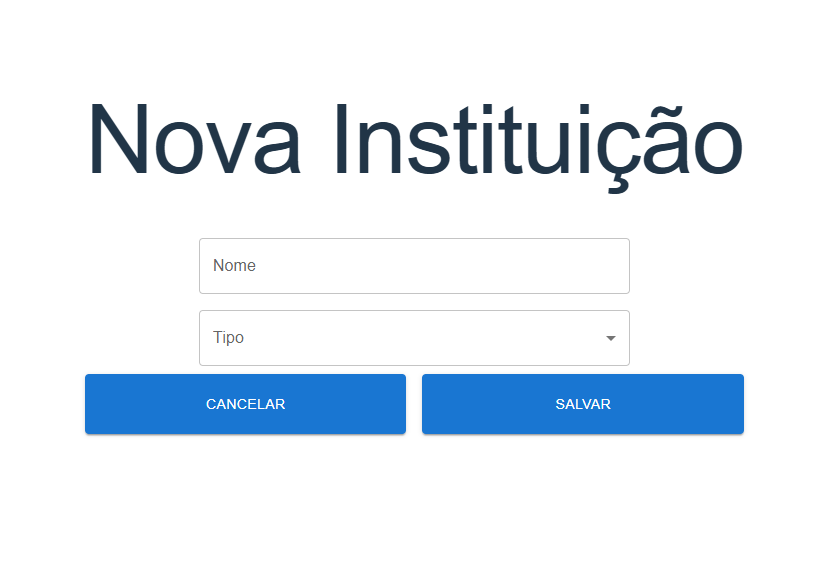

# CRUD Eventos
É um sistema de gerenciamento de eventos.

### O sistema possui:
- Cadastro de Insituição;
- Cadastro de Evento;
- Validação de ativação ou inativação de evento;

### Tecnologias utilizadas
- Java 17
- Spring Boot
- Maven
- Flyway
- PostgreSQL
- React
- Axios
- MUI - Material-UI

## Como usar
- Clone o repositório
- Criar um banco de dados postgres com o nome `crud_eventos`

**Projeto Backend**
- Configure o arquivo `application.properties` com as informações do banco de dados
- Rodar `mvn clean install` para baixar as dependências
- Rodar a aplicação
  - Ao rodar a aplicação o Flyway irá criar as tabelas no banco de dados automaticamente

**Projeto Frontend**
- Rodar `npm install` para baixar as dependências
- Rodar `npm run dev` para rodar a aplicação

## Sobre
O sistema possui dois CRUDs completos, um para cadastro de instituições e outro para cadastro de eventos.

A tela inicial é apresentado as duas opções de cadastro, Instituição e Evento.

Ao clicar em **INSTITUIÇÃO** é redirecionado para a tela de listagem de instituições, onde é possível visualizar, editar e excluir os registros.

Ao clicar em **ADICIOANR NOVA INSTITUIÇÃO** é redirecionado para a tela de cadastro de instituição.

Caso clique em **EVENTO** na tela incial é redirecionado para a tela de listagem de eventos, onde é possível visualizar, editar e excluir os registros.

Ao clicar em **ADICIONAR NOVO EVENTO** é redirecionado para a tela de cadastro de eventos. 
Obs.: O campo Ativo não fica disponível para edição, pois é um campo que o sistema faz a validação para ativar ou desativar conforme as datas informadas.

### Validações
Os campos de datas possuem validações no backend:
- A data de início do evento não pode ser menor que a data atual
- A data de fim do evento não pode ser menor ou igual que a data atual
- A data inicial do evento não pode ser maior que a data final
- A data inicial do evento não pode ser igual a data final

Os demais campos foi utilizado a validação do próprio Jakarta nos DTO para garantir que os campos não sejam nulos ou vazios.

### Validação de ativação ou inativação de evento
Quando salvado um evento, podendo ser novo ou edição, o sistema valida a data inicial, se for igual a hoje, já grava o evento como ativo.  
Para os demais que possuem datas futuras serão ativados pelo scheduler.  
Foi utilizado o sistema de agendamento do Spring `@Scheduled`, o qual todo dia a meia noite verifica os registros em banco para ativar os eventos conforme a data inicial, ou desativar conforme a data final. 

**Porque foi escolhido o sistema de agendamento?**  
Quando penso em tarefas agendadas, sempre penso em scheduler primeiro, pois o mesmo tem como principal função executar tarefas em um determinado horário.  
Além disso o scheduler é simples e rápido de ser implementado. Acredito que para um sistema pequeno, o scheduler é a melhor opção.  

Claro que se fossemos analisar um sistema maior, onde precisa de resiliência e escalabilidade, talvez o scheduler não seja a melhor opção.